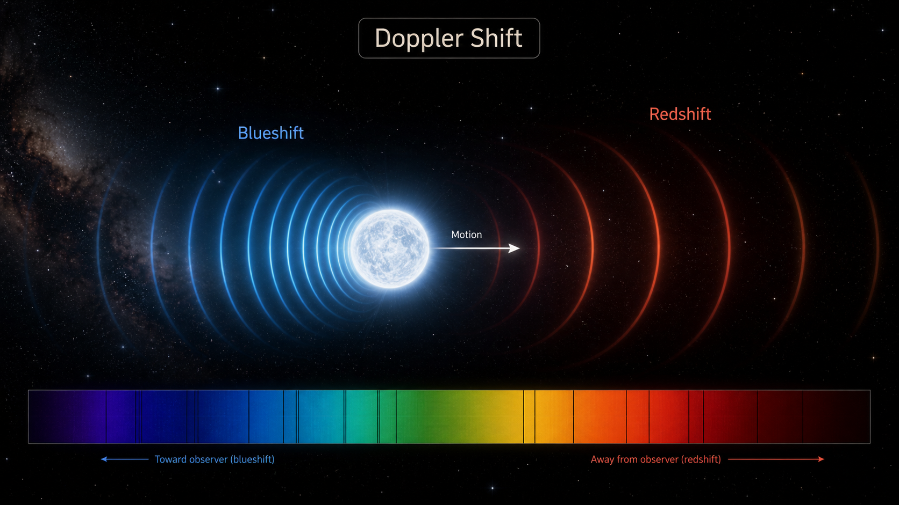

<p align="center">
  
</p>

# Doppler Shift Visualiser

A simple Python and web-based tool for visualising Doppler shift in astronomical spectra.

## What this project does

This project shows how spectral lines move when an astronomical object has radial motion relative to the observer.

- Positive velocity means the object is moving away: redshift
- Negative velocity means the object is moving towards us: blueshift

## Physics background

For small velocities compared with the speed of light, the Doppler shift can be approximated as:

Δλ / λ = v / c

where:

- Δλ is the change in wavelength
- λ is the original wavelength
- v is radial velocity
- c is the speed of light

## Why this matters

Doppler shift is central to observational astronomy. It is used to study:

- radial velocity of stars
- exoplanet detection
- binary stars
- galaxy motion
- spectroscopy

## Live Demo

[Try the interactive tool](https://biswajit1999.github.io/doppler-shift-visualiser/web/)

## Licence and attribution

Code in this repository is released under the MIT Licence.

Images, diagrams, written explanations, and educational content are © 2026 Biswajit Jana unless otherwise stated.

Please credit this repository if you reuse or adapt any visual or explanatory material.

Suggested attribution:

“Doppler Shift Visualiser by Biswajit Jana — https://github.com/Biswajit1999/doppler-shift-visualiser”

## Python version

Run:

```bash
pip install -r requirements.txt
python main.py

## Research Quality Upgrade

See [RESEARCH_QUALITY.md](RESEARCH_QUALITY.md) for the validation layer, reference anchors, equations and research boundaries added to this repository.
